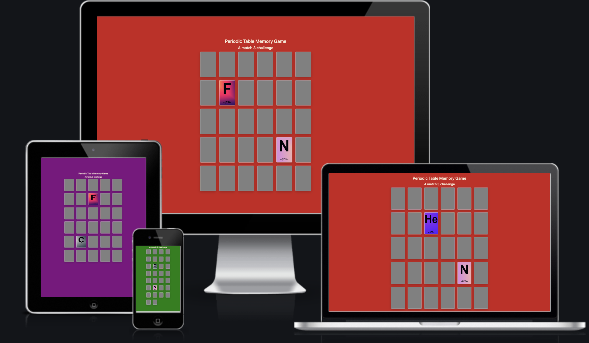
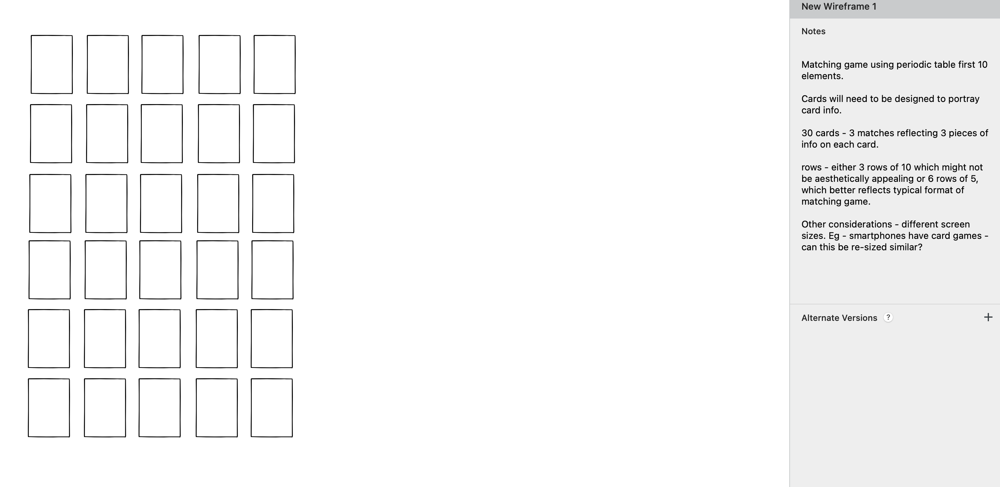
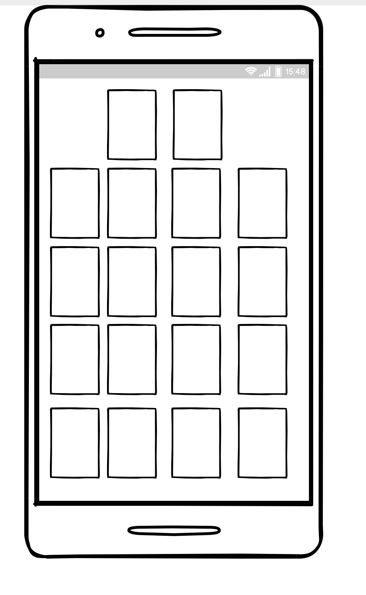
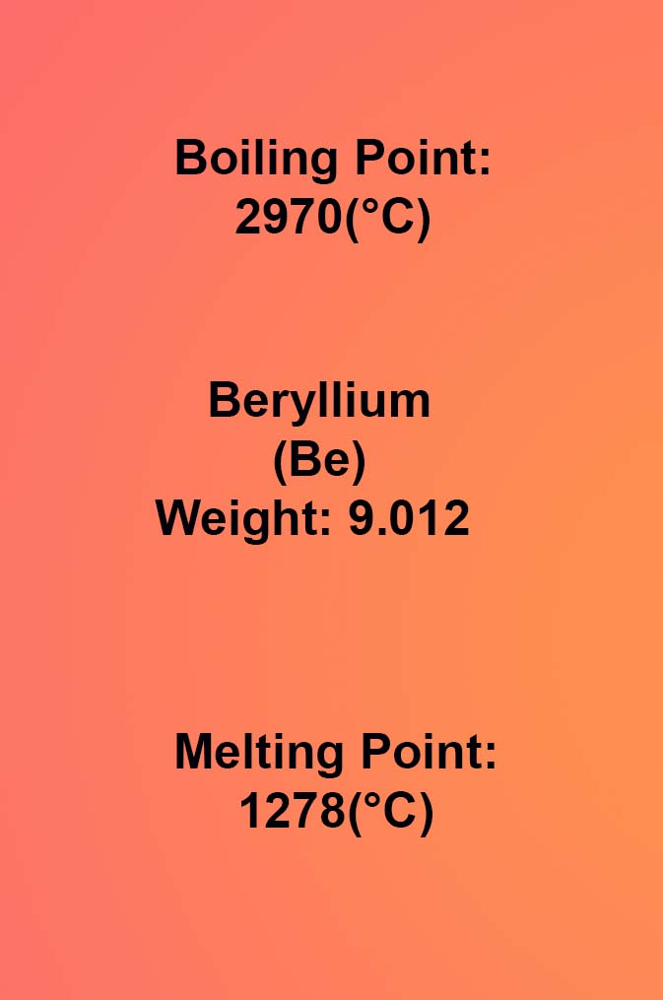
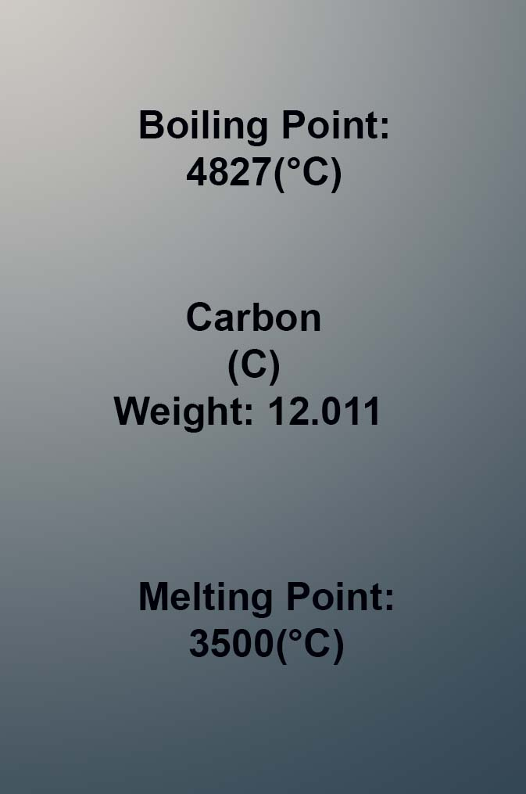

# Periodic Flip #

## A Memory Game Featuring Periodic Table Elements ## 

**Original thoughts about the Game**

This is a memory game with information about elements from the periodic table where you match 3 cards.

Originally conceived to have the first 10 elements of the periodic table, I decided that I would create cards with 3 pieces of information about each element alongside the name - symbol, boiling point and melting point.

Reflecting the 3 pieces of information, each card would appear three times in the game. Each set of cards has a different colour background. I originally debated whether to follow a more traditional approach in the colours used for each, reflecting the periodic table, but decided to choose colours as I went along instead.

Original plans were worked out with wireframes, and I wanted to keep things simple as the core focus was on the game element rather than designing something more complicated. Having 10 cards with 3 matches meant the set up would require 30 cards in total, meaning the grid would need to either be 5 columns and 6 rows or 6 columns and 5 rows. 

I decided I wanted the set up of the site to be written predominantly in JavaScript rather than creating it all in HTML, and only having the game functions in JavaScript. I watched a number of videos based on making match 2 games, to get an understanding of what I would need to include to create the kind of game I wanted to make. 

One key part was changing the number of matches from 2 to 3, as this was not covered by any of the videos I watched - I knew this would be something I would very much be on my own with. 

I decided to create the game by making it a match 2 cards to begin with to ensure my logic was sound, and then, once the functionality was up and running I would be able to amend the code to change it from 2 matches to 3. This was done at a later stage during the development of the JavaScript close to the end of making the game work.

I decided that other than creating the cards, I would hold off formatting the site until the functionality was completed. Styling the site would be one of the last stages of creating the site.

## **Planning stage**
### **Target Audiences:**
* Users who want to learn about the periodic table in a fun way
* Users who want to learn while they play
* Users who want a game that is more than match 2
* Users who enjoy memory games 

### **User Stories:**
* As a user, I want play a fun matching game that is informative
* As a user, I want to learn something while I play
* As a user, I want to challenge my memory by playing a game
* As a user, I want to be able to play the game again with the cards in a new order

### **Site Aims:**
* To educate the user in a fun way
* To ensure the cards change order after the game is completed
* To ensure the site is responsive

## **How Is This Will Be Achieved:**
* The game will feature information about the first 10 elements on the periodic table in a colorful way, with the JavaScript ensuring that the cards are re-sorted at the end of every game.  

* The site will be simple and colorful, so that the focus is kept on the game, and on the information on the cards rather than having a distracting background which could detract from the learning experience.

### **Wireframes**

I created wireframes with the basic idea of how to format the game to give a starting point for the development of the site.

There was deviation from the initial plans as the site progressed in terms of what kind of size best suited the cards and how they would look across different versions in terms of size. one of the challenges was the number of cards involved, as there were 30 cards and the format of these could require some compromising, to ensure they fit comfortably on screen and the information remains readable for the user.

### **Color Scheme**

The color scheme became a dynamic one during the project. As the focus is meant to be on the cards, these were designed to be colorful, and the rest of the page should not detract from them, however, I decided that having a white background would not be in keeping with the overall aesthetic appeal - the game is meant to be a fun one, and therefore for the background colors I decided these would be bright and vivid, but also not take away from the vibrancy of the cards. 

I also decided that not all the cards should be bold colors and therefore, the color scheme for the cards: Carbon, Lithium and Nitrogen are more muted in tone and color.

## **Page Set Up**

There is only one page for the game. I decided against having any additional pages as the focus is the game and not a site for multiple games on different pages. The page is minimal with the only two pieces of text - the title of the game and the statement that it is a match 3 game. Clicking on a card will rotate the card, and this is doable until 3 unmatching cards are clicked at which point they rotate back. Clicking on 3 matching cards will freeze the cards, and therefore the user should be able to understand the game relatively quickly. 

## **Future-Enhancements**

A number of future enhancements could be created for the page. Below are some of the ideas that have been considered:

* change the number of cards to a lower amount, and then increase to 30 by creating different levels.
* add in game lives to give an additional challenge.
* add in a timer as an additional challenge.
* create more cards from periodic table, and create a bigger grid - this could tie in to number of levels.
* create an additional page with more info about each of the elements on the cards should the user wish to learn more.
* consider amending card design for a faster site.

## **Credits**

This project would not exist without the assistance on my mentor Richard and the Code Institute community on slack.

A final thank you to the five year old who beat me at a memory matching card game earlier in the year before this project started, who shall remain nameless. You reminded me of how much I enjoy card matching games, whether physical or virtual. This game is for you!

## **General References**

The project was influenced by [Awesome Vanilla JavaScript Memory Card Game Tutorial](https://www.youtube.com/watch?v=-tlb4tv4mC4) by Dev Ed available on YouTube. 

I also consulted [Memory Card Game - JavaScript Tutorial](https://www.youtube.com/watch?v=ZniVgo8U7ek) by freeCodeCamp.org available on YouTube.

Whilst I have deviated from these, there may be some similarities in code.

My congratulations you've won button is based on [Sweet Alert 2](https://sweetalert2.github.io/#examples) pop ups with amended code specifically for the game.

I have put Boostrap links in, in anticipation of future development using their functionality.

I relied upon W3schools, MDN web docs and stack overflow for general references throughout the project.

## **Content**

All cards have been created by myself, using information freely available regarding the properties of the first 10 elements of the periodic table.

* Testing documentation is available in the TESTING.MD file.

