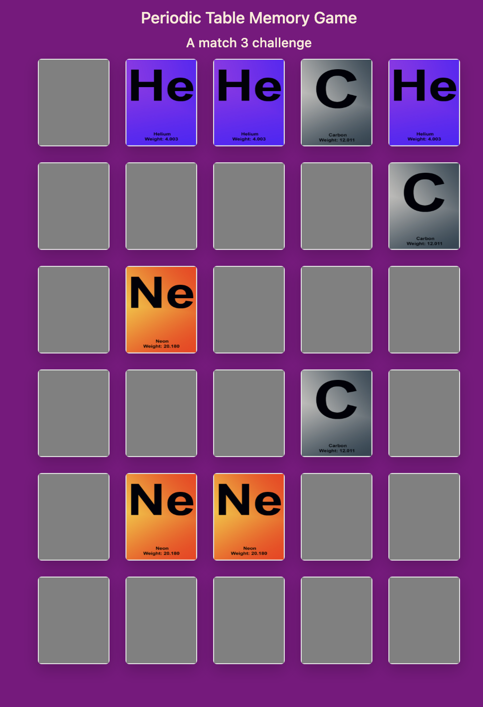

 # Periodic Flip #

## A Memory Game Featuring Periodic Table Elements ## 

**About the Testing**

During development testing, each stage was manually tested to ensure that the game's functionality and appearance were both working well. 

*An early image of the game.*

Originally the game was built as a match two game to ensure the functions worked, and following on from this code was amended to ensure that the original plan of the game being a match 3 game came to fruition. 

**Work in Progress**

* During the testing phases a specific class was added to the css as a place for any additional test styling - this was left in until a later stage, and was finally removed towards the end stages. It enabled me to have a place to work specifically with the styling and having a point of reference. This has now been removed from both the css and js files.

* While testing the responsiveness of the design I changed the background colors to show me the exact break points as I re-sized my screen, during this I discovered that I preferred having the different colour backgrounds on different size screens and consequently decided to make this a permanent part of the site.

**Making the Site**

* The first phase of testing was to recall the cards and make sure the links were created properly, so originally only 10 cards were imported into a grid. Once these were successfully added the remainder of the cards were added in. As the plan was always to have a match 3 game, 30 cards in total were imported into the script file, but the original test was written for a match 2.

* Randomising the cards was a key element of the game plan and this was thoroughly manually tested using console.log to ensure the logic of the function was sound.

* Creating the cards to be double-sided brought it's own challenges, as at the beginning the card front and back did not align properly, but after amending the styling in the css the alignment was corrected.

* It was considered to have a logo or design on the rear of the cards, however it was felt that this could overly complicate the user's view, and therefore the cards were styled as having a gray background-color.

* During the process, once the js was written and was working, the focus shifted to the styling of the cards, and editing the css to create a user-friendly site.

* During the deployment it was discovered that the images were returning a 404 error. This was queried on Slack, and it was pointed out that the pages needed to be relative not absolute. After a quick amount of amending the deployed version had the correct images.

**Validations**

HTML checker

As the the majority of the site is created in the js file, not HTML I decided against adding anything that was not required. If there was more in the file, I would amend this.

CSS 

JS

Lighthouse

Interestingly lighthouse issues with the card design on mobiles - more on this below.

**Responsiveness**

Media query has been used in css to create 4 versions of the site depending on the size of the screen. Whilst they do work in their current state, future versions could continue to improve the styling to improve the formatting - especially on the mobile screen. I discussed this with my mentor, Richard and one future option could be to have different grids, and slim down the number of cards in the game.

**Card Design Challenges**

Originally the plan for the game was to have 3 pieces of information on the cards about the first 10 elements of the periodic table. Some of the original card designs can be seen here:

However, it became increasingly obvious as the the testing continued that the smaller the screen the harder it was to read the information - defeating the objective of aiding learning that had been part of the original plan for the game.

I did try to create a variation with larger text on the card but that did not seem to be the right solution either.

After discussions with my mentor, Richard, the solution seemed obvious. The cards were my design so I could simply change the design to focus on less information, and instead have the symbol for the element as the focus, with the name below. I kept in the infomation about the weight of the elements as I felt there needed to be something in keeping with the original concept. 

As you can see the symbols are clear on all screens, not just the larger ones. Success!

However, as can be seen with the testing on Lighthouse, there is still room for improvement regarding the card design. This is something to consider for the future.

**Jest Testing**

Jest testing is new to me and I admit I struggled with creating tests to test the site. At one point I wondered how I had managed to create a test that implied my site was broken, when alongside my site was working fine. I got very confused. 

**Issues Encountered**

* Failing to initialise. Despite following the instructions and installing jest, I found it seemed to uninstall on it's own accord. I wouldn't be surprised if you tried to run it now and the site decided it had no memory of it! As a total beginner to using it, I spent a considerable amount of time wondering if it was something I was doing wrong or whether there was something I'd missed. It did not build my confidence in understanding jest. 

* Writing the wrong test. Now this was my biggest failing and it took quite a few reviews and comments from others to work out where I was going wrong. To be fair to me - most of them didn't spot the issue either. I wrote a test for flippedCards. The test was expecting to see flipped cards - a function that worked perfectly well on the site. Unfortunately what I forgot to add in, was to create the steps that would have happened before that part of the code ran. It failed. Miserably, and I failed to work out why it was failing. Suffice to say, my confidence in understanding jest took another knock. 

**Outcomes**

My initial plan for writing tests in jest, based on my experiences above, meant my confidence in understanding what I was doing was at an all time low. I have changed the test, but I won't document it here, as one of the problems I encountered is something that requires more testing. My plan to create tests for the step by step development of the site felt like a step too far for me. I decided on reflection to put that aside and focus on the site development itself.

How do I plan to fix this in the long run? I aim to review my understanding of the functionality of jest and learn to write tests better. I will say that creating a failing test was a big learning experience for me. I spent a lot of time looking on the internet to see if I could work out the solution to my failing test, and learned quite a bit about what else could have made it fail. Since then, I have re-reviewed the documentation and videos on Code Institute, and I will say that I understood a lot more, and could see some of the errors I had made originally. 

**Evaluation**

Overall, the site works. The cards flip, the game runs and re-sets to start again. The initial aims are all well met.

 **Target Audiences:**
* Users who want to learn about the periodic table in a fun way
* Users who want to learn while they play
* Users who want a game that is more than match 2
* Users who enjoy memory games 

 **User Stories:**
* As a user, I want play a fun matching game that is informative
* As a user, I want to learn something while I play
* As a user, I want to challenge my memory by playing a game
* As a user, I want to be able to play the game again with the cards in a new order

**Site Aims:**
* To educate the user in a fun way
* To ensure the cards change order after the game is completed
* To ensure the site is responsive

That being said however, I can see a number of opportunities to improve the site - whether it be changing the cards, or adding in levels, there is a lot of potential for the site to be something I could build on in future and make it a more challenging and fun experience for users.  

**Final Thoughts**

I have learned far more than I thought I would in creating the site. It threw up more problems than I anticipated - not so much in the actual building of the game, but in all the other parts of creating the site - whether it be redesiging the cards twice, having what seemed like endless problems with jest, and on more than one occasion making what I thought would be a minor change to the css and finding my entire game vanished - ctrl z was probably my most used keyboard shortcut.

I can see areas that would like to re-examine at a later point when I've stepped away from it all for a bit, and part of me would probably like to try re-building it all from scratch - which I did do, but found that my edits there were even worse than the problems I encountered here (hello again jest), and that perhaps I was better off building on what I'd already done, rather than chucking it all out and starting again. 

There are bits I'm pleased with and parts I'm still frustrated with - which is all part of the learning process. Suffice to say, it's not 100% where I thought it would be when I started, but it's helped me move far further along my learning journey than I ever would have thought. 

Finally, it's reminded me just how much I do enjoy memory matching games; and playing the game over and over was a joy.

